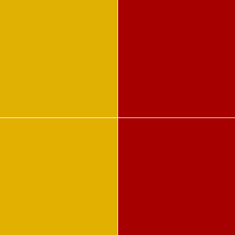

# dichroic_mirror
For a class (3.024 @ MIT) I had to model a dichroic mirror by representing the materials as a series of matrices, and to determine how the spectrum of visible light reflects/refracts with the mirror. Absorption was assumed negligible. I initially wrote the script in Mathematica, but I decided to teach myself Julia and Rust by porting the solution through both languages.

## Julia Output
Julia generates graphs of reflectance vs wavelength

## Rust Output
Rust generates an image of the colors that would be seen @

| TE_reflected | TE_transmitted |
|--------------|----------------|
| TM_reflected | TM_transmitted |

